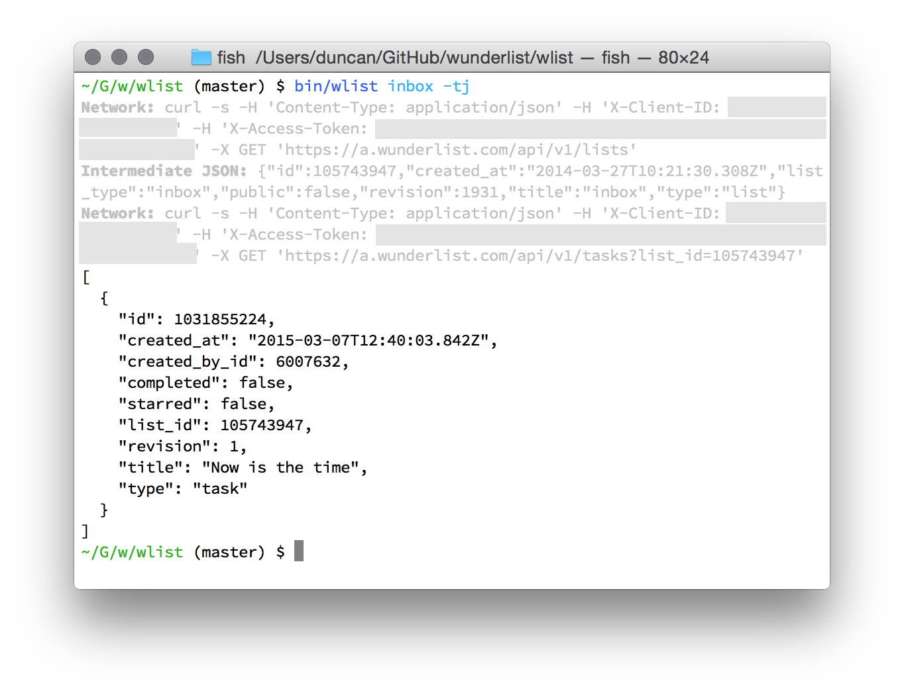

# wlist

A command-line tool for interacting with Wunderlist’s REST- and JSON-based API. It’s currently under initial development, but is already useful as a developer exploration tool, especially when used with the `-v` flag to display the `curl` statements used.



There are two goals for `wlist`:

1. Provide an easy to use way to explore the API and its output for developers
2. Allow shell scripting of the API for integrations, especially with JSON tools like `jq`

Comfort with dealing with JSON data structures is assumed.

## Installation

For now, clone this repository and then put `bin/wlist` on your path somehow.

## Requirements

To use this tool, you’ll need the following:

* Ruby, should be on your system. I’m using 2.2 here. YMMV with other versions
* A client id. You can get one at the [Wunderlist Developer Site](https://developer.wunderlist.com/apps). Once you have it, you’ll want to set it in the `WLIST_CLIENT_ID` environment variable.
* An access token. This is tough right now. We’re going to fix this ASAP.

If you try to use `wlist` without a `WLIST_CLIENT_ID` set, you’ll get gently nudged in the right direction:

    $ bin/wlist inbox
    Missing $WLIST_CLIENT_ID in environment
    Visit https://developer.wunderlist.com/applications and create an app!

Likewise with the access token

    $ bin/wlist inbox
    Missing $WLIST_ACCESS_TOKEN in environment.

To make all this easier, I have a fish script that sets these variables for me before calling `wlist`. Here’s what it looks like:

    function wlist
      source ~/.envrc/wunderlist_poke.fish
      eval $HOME/GitHub/wunderlist/wlist/bin/wlist $argv
    end

My `~/.envrc/wunderlist_poke.fish` simply has:

    set -x WLIST_CLIENT_ID id
    set -x WLIST_ACCESS_TOKEN token

Yah. Most people use Bash or Zsh. Let’s fix this up for them too so that they don’t have to translate in the mind.

## An example walk through

Ok, let’s assume you’re setup with your client id and access token. Let’s take `wlist` for a spin! The first thing you might want to do is to get some information about your inbox:

```
$ wlist inbox
```

```json
{
  "id": 105743947,
  "created_at": "2014-03-27T10:21:30.308Z",
  "list_type": "inbox",
  "public": false,
  "revision": 1957,
  "title": "inbox",
  "type": "list"
}
```

The JSON returned is a direct map of the inbox list properties on the Wunderlist servers. If `wlist` was just aimed for non-developers, it would probably give us a list of tasks in our inbox, but we want to make sure that we’re reflecting the API appropriately so that you can explore how it works.

So, using the inbox properties, we can use the `id` property and get that list:

```json
$ wlist list:tasks -i 105743947
```

```
[
  {
    "id": 1032917523,
    "created_at": "2015-03-08T07:50:20.807Z",
    "created_by_id": 6007632,
    "created_by_request_id": "d46c6d8d45e73a232c56:441EBB5C-9D53-438E-934B-773E66E844E8:6164D6EE-0A3F-4077-ACD6-80DD836D25C3:6007632:12CF5985-A746-4A7A-AC51-BEB63FC83588",
    "due_date": "2015-03-08",
    "completed": false,
    "starred": false,
    "list_id": 105743947,
    "revision": 1,
    "title": "Connect Sunrise to personal calendars",
    "type": "task"
  },
  {
    "id": 1033100007,
    "created_at": "2015-03-08T11:52:26.706Z",
    "created_by_id": 6007632,
    "completed": false,
    "starred": true,
    "list_id": 105743947,
    "revision": 7,
    "title": "Get some coffee",
    "type": "task"
  }
]
```

There are two tasks in this inbox. What if we want to change the title of that second event to include who we’re going to have coffee with? One way to do this is to pipe a JSON structure containing a new `title` and the `revision` of the task into `wlist` as follows:

```
$
echo '{"title": "Get coffee with Chad", "revision": 7}' | wlist task:update -i 1033100007
```
```json
{
  "id": 1033100007,
  "created_at": "2015-03-08T11:52:26.706Z",
  "created_by_id": 6007632,
  "completed": false,
  "starred": true,
  "list_id": 105743947,
  "revision": 8,
  "title": "Get coffee with Chad",
  "type": "task"
}
```

The `revision` is essential so that the server knows whether or not you have the current data. Here’s what you’d get back if you try the command again with an invalid `revision`:

```json
{
  "error": {
    "type": "conflict",
    "translation_key": "api_error_conflict",
    "message": "There is a conflict with the given data.",
    "revision_conflict": true
  }
}
```

### Pipelining as a shortcut

When `wlist` is run in a pipeline, it can pick up JSON data from a previous command and use that as part of the next request. For example, if we’ve stored the id for our task, we can quickly star it with the following command:

```
$ wlist task -i 1033100007 | wlist task:update --star
```
```json
{
 "id": 1033100007,
 "created_at": "2015-03-08T11:52:26.706Z",
 "created_by_id": 6007632,
 "completed": false,
 "starred": true,
 "list_id": 105743947,
 "revision": 18,
 "title": "Get coffee with Chad",
 "type": "task"
}
```

### Lists

Wunderlist manages more than just an inbox list. It can hold as many lists as you want. To get all the lists a user has access to, use the `lists` command:

```
$ wlist lists
```

```json
[
  {
    "id": 81895952,
    "created_at": "2013-08-09T11:39:08.246Z",
    "list_type": "list",
    "public": false,
    "revision": 2,
    "title": "Movies to Watch",
    "type": "list"
  },
  {
    "id": 105743947,
    "created_at": "2014-03-27T10:21:30.308Z",
    "list_type": "inbox",
    "public": false,
    "revision": 1958,
    "title": "inbox",
    "type": "list"
  }
]
```

Then, to get all the tasks for a list, you can use the `list:tasks` command:

```
$ wlist list:tasks -i 81895952
```
```json
[
  {
    "id": 406750264,
    "created_at": "2013-08-27T02:33:20.493Z",
    "created_by_id": 6007632,
    "completed": false,
    "starred": false,
    "list_id": 81895952,
    "revision": 0,
    "title": "Meet the Parents",
    "type": "task"
  }
]
```

### Convenience Commands

As benefits its status as a developer aid, the `wlist` commands so far make you think in terms of the API. However, we don’t want it to be bulky to use for everyday use, so we have several convenience commands. The first of these is a way to list the tasks in your inbox:

```
$ wlist inbox:tasks
```

This is exactly equivalent to what we did at the start of the walkthrough: it gets the list of tasks after getting the `id` of the current user’s inbox.


### Tracing Requests and getting Curl Commands

In addition to directly working with the Wunderlist API JSON formats, `wlist` gives you the ability to trace what goes into making a particular request. Use the `-v` or `--verbose` flag with any command and you’ll see a `curl` command used to make the request. This command can be copied, pasted, and ran by itself.

```
$ wlist list:tasks -i 105743947 -v
curl -s -H 'Content-Type: application/json' -H 'X-Client-ID: WLIST_CLIENT_ID' -H 'X-Access-Token: WLIST_ACCESS_TOKEN' -X GET 'https://a.wunderlist.com/api/v1/tasks?list_id=105743947'
```
